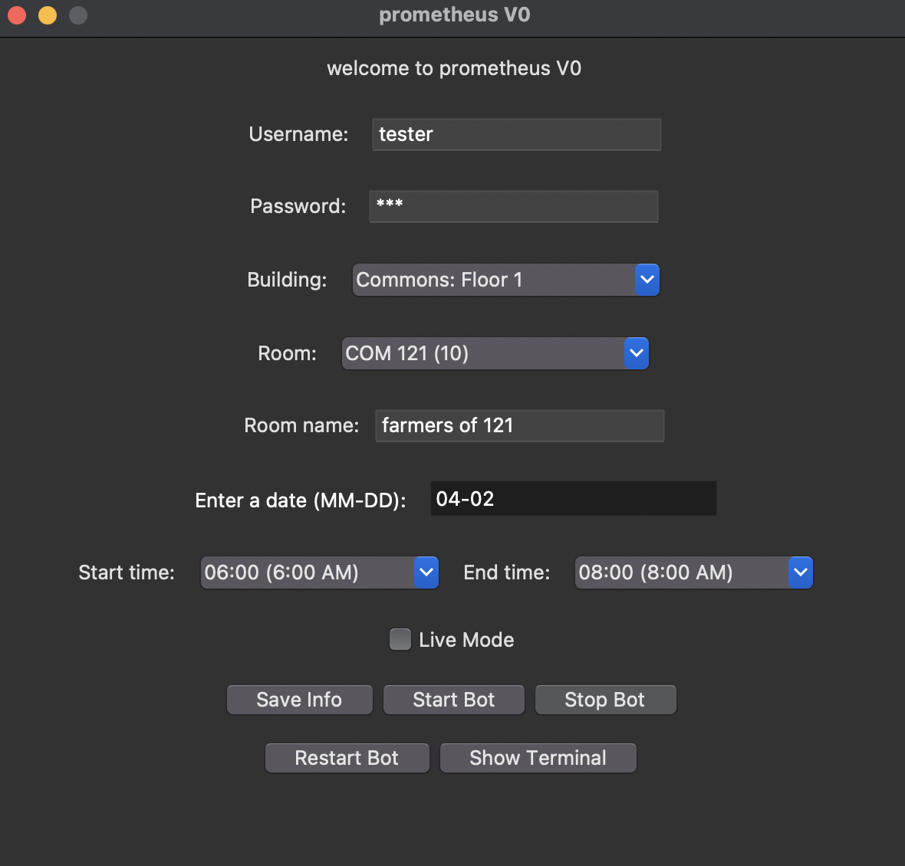
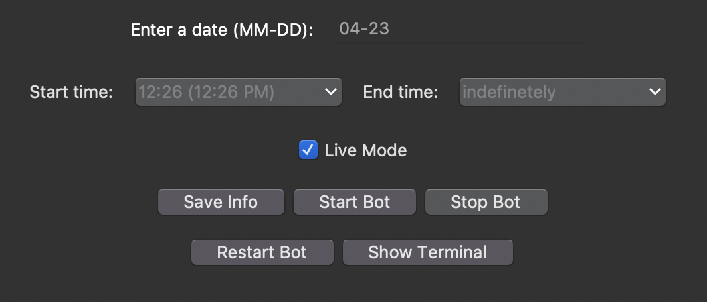
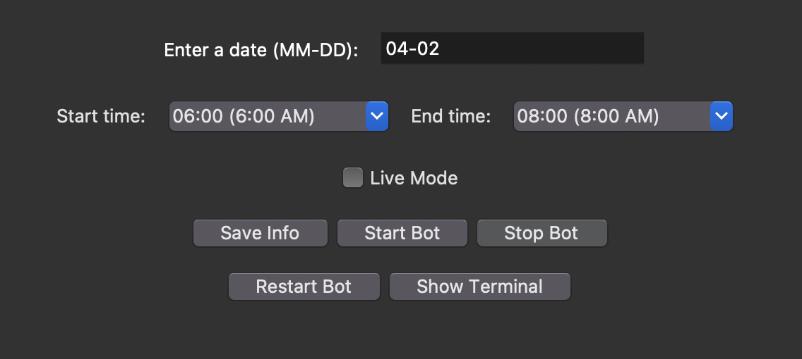

# Please set up your environment before running the program via [this tutorial](Tutorial.md) and read the [update logs file](UpdateLogs.md) for the latest updates.

# Introducing, prometheus.

This python script, prometheus application is a room booking bot for study rooms in UBCO's study room booking system. It is a [Python](https://www.python.org/) program that uses [Selenium](https://www.selenium.dev/) to automate the booking process. It is a command line program that will guide you through the process of booking a room. It is currently under development, and is not yet ready for use. Please use the correct OS version of the program for your system.

# Live Mode.

- `Live Mode` is a competetive way of booking a room by using advanced timing algorithm to determine when is the next most available spot for your booking. The UBCO Booking System only alows booking as far as 3 weeks from now exactly at the time from today. Check the UBCO Booking System Policies for more information.

## When on

- Turning this on will set the date to 3 weeks from now and the time to the next available time slot. This will allow you to book the setted room as soon as possible.

## When off

- Turning this off will revert back to your saved changes.
