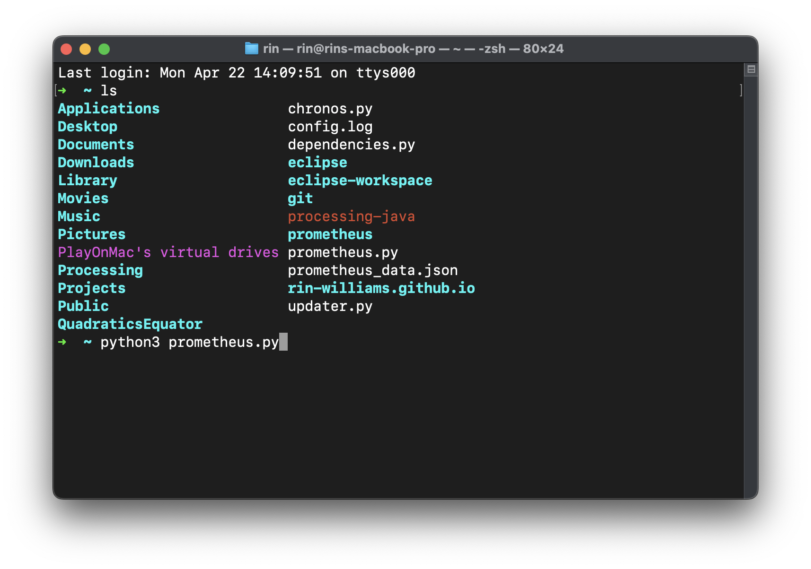

# Please set up your environment before running the program via this [tutorial](#tutorial) and read the [update logs file](info/UpdateLogs.md) for the latest updates.

# Introducing, prometheus.

This python script, prometheus application is a room booking bot for study rooms in UBCO's study room booking system. It is a [Python](https://www.python.org/) program that uses [Selenium](https://www.selenium.dev/) to automate the booking process. It is a command line program that will guide you through the process of booking a room. It is currently under development, and is not yet ready for use. Please use the correct OS version of the program for your system.

<p align="center">
    
</p>

## Policy

- This program follows the UBCO Booking System Policies, it will book the rooms if:
  - The room is within 3 weeks from now.
  - The room is not already booked by the user or someone else.
  - You have the not booked the room for the week already.

# Live Mode

###### (to be implemented from deprecated code [bookingbot.py](deprecated_files/bookingbot.py))

- `Live Mode` is a competetive way of booking a room by using advanced timing algorithm to determine when is the next most available spot for your booking. The UBCO Booking System only alows booking as far as 3 weeks from now exactly at the time from today. Check the UBCO Booking System Policies for more information.

## When on

<p align="center">

</p>

- Turning this on will set the date to 3 weeks from now and the time to the next available time slot. This will allow you to book the setted room as soon as possible.

## When off

<p align="center">

</p>
- Turning this off will revert back to your saved changes.

## Tutorial

### Prerequisites

- Software-wise, you will need:

  - [Google Chrome](https://www.google.com/chrome/) installed on your device.
  - [Python](https://www.python.org/downloads/), latest version installed on your device.

- Before running:

  - One of the folders for your OS. If you are on Windows, download the `Windows` folder. If you are on macOS, download the `macOS` folder.
  - Other libraries will be downloaded by `dependencies.py`.
  - You will need to have a UBCO student account to book rooms.

- Make sure you have `chronos.py`, `updater.py`, `dependencies.py`, and `prometheus.py` in the same directory.

- You must download one of the folders for your OS. If you are on Windows, download the `Windows` folder. If you are on macOS, download the `macOS` folder.

- Once installed, run the program by opening the `prometheus.py` file with **Python Launcher**, if you are experienced with **terminal**, place the file in a directory that is easily accessible (such has your home dir) and run the program with

```
python3 prometheus.py
```

<p align="center">
    
</p>

- Fill out all infos, and then run the program. Make sure you have DUO Push set up with your phone, before running the program.

### When running

- If using UBCO wifi, you will not need to send a DUO push.

- If you choose not to enter the right credentials, the script will not work and will ask you to rerun the program. Once you enter the right credentials, the program will save your credentials in `prometheus_data.json` file, where it is saved in the same directory as the script.

- It is good to know that if you are booking multiple sessions, for example, `06:00 - 08:00, 08:00 - 10:00, 10:00 - 12:00,` you will not need to run the program multiple times. The program will automatically book the next session for you as long as your `End time:` is set to `12:00`.

### Important

- No malicious intent to any parties involved. Please use with caution, any misuse of this program is not the responsibility of the developer, including but not limited to, booking rooms without the intention of using them, or booking rooms for the purpose of preventing others from using them. This program is not intended to be used for such purposes.

- If security is a concern, please check the source code of the program before running it.

- This program is open source & free to be modified, and the developer is not responsible for any damages that may be caused by the program. Use at your own risk. Check the [license](/LICENSE.txt) for more information.
